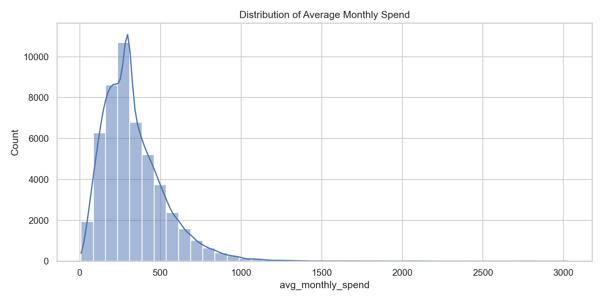
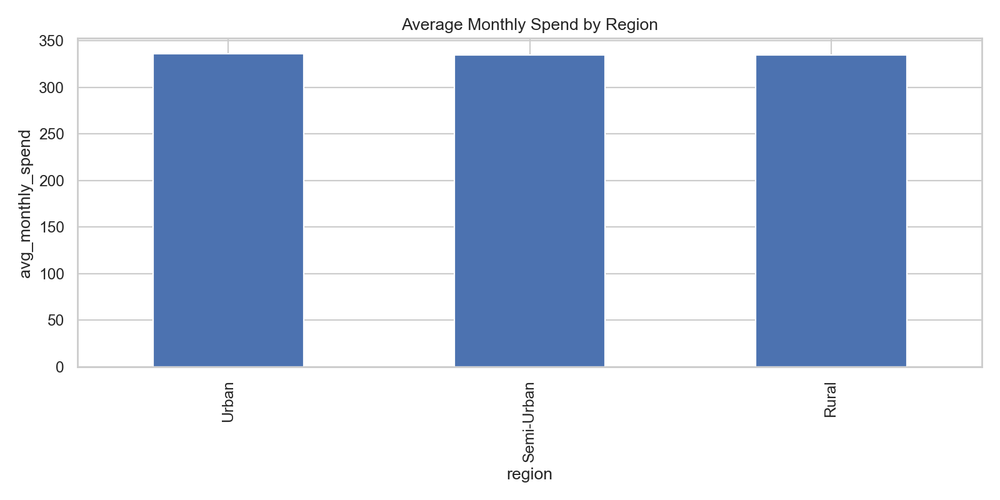
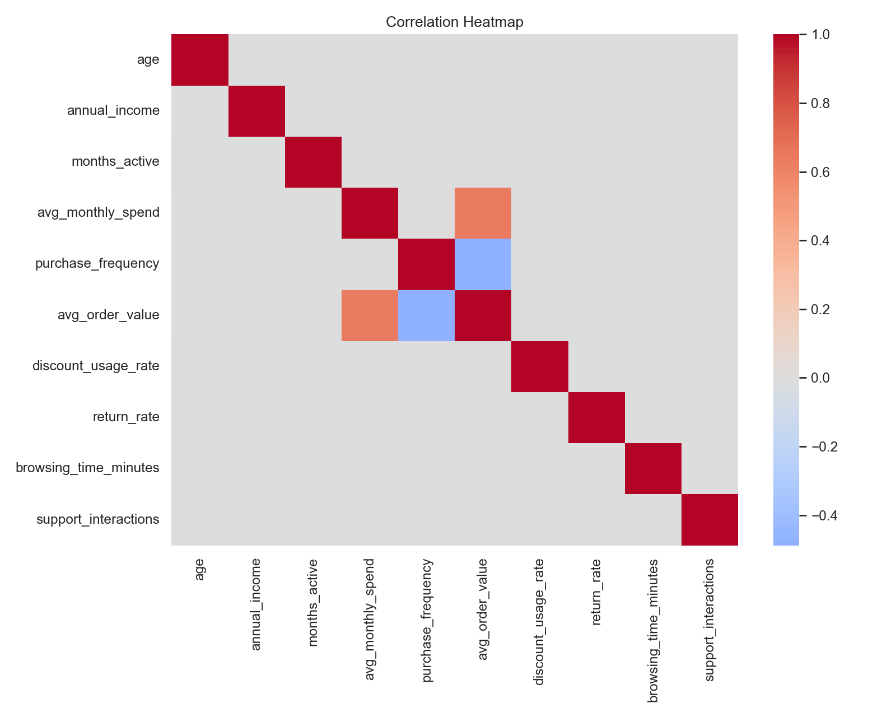
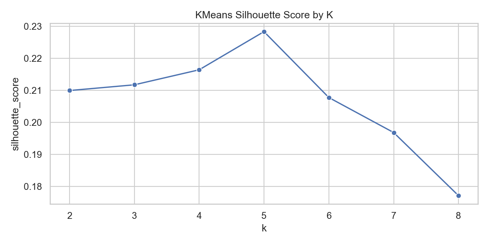
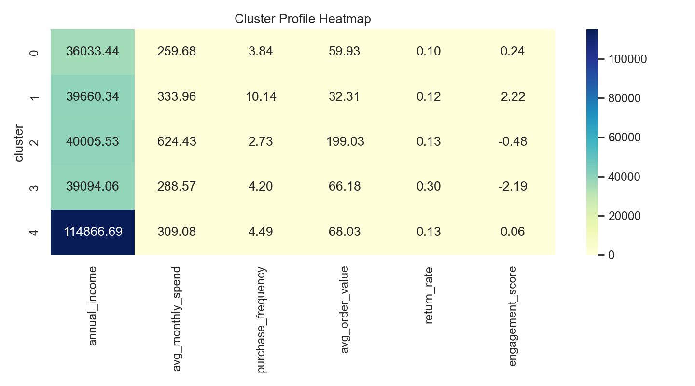

# Customer Behaviour and Segment Modelling

## TL;DR
- Analysed 50,000 customer-level retail records to understand segment behaviour and commercial drivers.
- Built a reproducible statistics-first pipeline (`scripts/run_statistics_portfolio.py`) that generates cleaned data, tests, clusters, figures, and reports.
- Key result: customer segments show strong spend differences (ANOVA p < 0.001 after correction, eta-squared 0.1335).
- Weak signals: payment method and discount-usage split do not meaningfully explain segment/value differences in this dataset.
- Unsupervised profiling supports 5 customer clusters (best silhouette 0.2283), useful for directional campaign targeting.
- Optional benchmark model: Random Forest outperformed logistic regression for segment prediction (accuracy 0.7543 vs 0.6669).

Quick summary view:
- [Recruiter Results Card](RECRUITER_RESULTS_CARD.md)
- [Quick Summary Results Card](QUICK_SUMMARY_RESULTS_CARD.md)

## Executive Summary
This project analyses a customer-level retail dataset (50,000 customers) to identify meaningful behavioural differences, evaluate segment structure, and produce actionable customer profiles.

Current run highlights:
1. Spending differs strongly across provided customer segments (ANOVA p < 0.001, eta-squared 0.1335, 95% CI [0.1224, 0.1453]).
2. Payment method is not a useful segment discriminator in this dataset (chi-square p = 0.7005 raw, FDR-BH p = 0.7472, Cramer's V 0.0062).
3. High vs low discount users show no meaningful difference in average order value (Welch raw p = 0.7472, Cohen's d 0.0029).
4. Unsupervised clustering supports a 5-cluster solution (best silhouette 0.2283, moderate separation).

## STAR Narrative
### Situation
Business teams need to understand why customer value differs and how to prioritise customer engagement. The available data is customer-level (already aggregated), not transaction-level, which changes what can be validly inferred.

### Task
Deliver a transparent, reproducible analytics workflow that:
1. Quantifies meaningful behavioural differences.
2. Identifies which variables are weak for targeting.
3. Produces practical segment profiles for campaign planning.
4. Documents uncertainty and avoids overclaiming.

### Action
1. Reframed scope to fit actual data structure:
- Moved from transaction/churn assumptions to customer-level segment analytics.
- Explicitly treated churn-style outputs as optional proxy work, not ground truth.

2. Built a reproducible pipeline:
- Script-first runner: `scripts/run_statistics_portfolio.py`.
- Auto-generates cleaned data, engineered features, test outputs, cluster outputs, and figures.

3. Enforced data quality and validation:
- Required schema checks (`customer_id`, spend, frequency, segment fields).
- Type coercion, missing-value handling, rate clipping to [0,1], non-negative constraints.
- Saved quality evidence to `outputs/tables/data_quality_report.csv`.

4. Designed statistically coherent tests:
- Spearman for monotonic association.
- ANOVA for segment mean differences in spend.
- Chi-square for categorical association strength.
- Welch t-test for two-group mean comparison with unequal variances.
- Added effect sizes (eta-squared, Cramer's V, Cohen's d), bootstrap confidence intervals, and multiple-testing correction to avoid p-value-only reporting.

5. Added unsupervised segmentation:
- Evaluated k via silhouette scores (`k=2..8`) and selected best k.
- Produced cluster profiles and cluster-vs-segment alignment tables.

6. Added optional supervised benchmark:
- Logistic regression and random forest for segment prediction.
- Kept this secondary to core statistical inference.

### Result
1. Delivered end-to-end reproducible analysis artifacts in `outputs/tables`, `outputs/figures`, and `reports/`.
2. Found strong segment-level spend differences (ANOVA p < 0.001; eta-squared 0.1335).
3. Identified weak targeting signals (payment method and discount split were negligible in this dataset).
4. Produced 5 directional customer clusters for campaign planning.
5. Produced an optional benchmark where random forest outperformed logistic regression (accuracy 0.7543 vs 0.6669).

## Analysis Lifecycle and Decision Log
| Lifecycle stage | Decision made | Why it was chosen | Evidence artifact |
|---|---|---|---|
| Problem framing | Prioritised segment behaviour over churn causality | Dataset lacks event-level churn ground truth | `README.md`, `reports/statistics_findings.md` |
| Data quality | Applied schema + range validation before testing | Prevent invalid assumptions from contaminating inference | `outputs/tables/data_quality_report.csv` |
| Feature engineering | Added value/engagement features (`annualized_spend`, `engagement_score`) | Improve behavioural signal beyond raw columns | `data/processed/customer_features.parquet` |
| Statistical testing | Used 4 complementary tests + effect sizes + confidence intervals | Cover correlation, group differences, and association strength with uncertainty bounds | `outputs/tables/statistical_tests_summary.csv` |
| Segmentation | Selected K via silhouette (not arbitrary k) | Reduce subjective model choice | `outputs/tables/kmeans_silhouette_scores.csv` |
| Communication | Wrote findings with practical interpretation and limits | Make decisions auditable and non-misleading | `reports/statistics_findings.md` |

## Accuracy Safeguards
1. Validation-first workflow before modelling/testing.
2. Effect size reporting to distinguish practical vs purely statistical significance.
3. Multiple-testing correction (Bonferroni and FDR-BH) across the test family.
4. Assumption and robustness checks logged in `outputs/tables/assumption_checks_summary.csv`.
5. Reproducible script execution to avoid notebook-state drift.
6. Explicitly separating strong signals from weak/non-significant signals.
7. No causal language for associational tests.

## What The Data Does Not Show
1. No true churn event label, so no definitive churn-risk model.
2. No intervention or experiment data, so no causal impact claims.
3. No time-stamped event history, so retention/cohort dynamics are limited.
4. Findings may not generalize without external validation data.

## Business Questions
1. Which customer groups are materially different in value behaviour?
2. Which variables are weak for targeting and should not drive strategy?
3. Can we form stable customer profiles for campaign planning?

## Dataset
Raw input:
- `data/raw/retail_customer_segmentation.csv`

Main columns:
- `customer_id`
- `age`, `annual_income`, `months_active`
- `avg_monthly_spend`, `purchase_frequency`, `avg_order_value`
- `discount_usage_rate`, `return_rate`, `browsing_time_minutes`, `support_interactions`
- `payment_method`, `region`
- `customer_segment`

## Reproducibility
From project root:

```powershell
python -m pip install -r requirements.txt
python scripts/run_statistics_portfolio.py
```

Optional ML benchmark:

```powershell
python scripts/run_statistics_portfolio.py --run-ml
```

## Git Publishing Workflow
For a clean, recruiter-friendly publish process, use:
- [PUBLISH_CHECKLIST.md](PUBLISH_CHECKLIST.md)

## Statistical Interpretation
From:
- `reports/statistics_findings.md`
- `outputs/tables/statistical_tests_summary.csv`

### 1) Purchase frequency vs average monthly spend
- Test: Spearman correlation
- Result: rho = `0.0042`, 95% CI `[-0.0146, 0.0249]`, p (FDR-BH) = `0.7031`
- Interpretation: There is no meaningful monotonic relationship. Increasing purchase count alone is not a reliable path to higher monthly spend.

### 2) Spend differences across provided customer segments
- Test: ANOVA
- Result: F = `2566.58`, p (FDR-BH) < `0.001`, eta-squared = `0.1335`, 95% CI `[0.1224, 0.1453]`
- Interpretation: Segment-level spend differences are statistically strong and practically relevant. Segment-aware pricing and engagement strategy is justified.

### 3) Payment method vs customer segment
- Test: Chi-square
- Result: p (FDR-BH) = `0.7472`, Cramer's V = `0.0062`, 95% CI `[0.0049, 0.0149]`
- Interpretation: Payment method has negligible relationship to segment. It should not be a primary feature for segment targeting in this dataset.

### 4) High vs low discount users on average order value
- Test: Welch t-test
- Result: p (FDR-BH) = `0.7472`, Cohen's d = `0.0029`, 95% CI `[-0.0246, 0.0300]`
- Interpretation: Discount usage intensity does not meaningfully separate order value here. Discount policy should be tested with richer behavioural context before rollout.

## Statistical Validity Checks
From `outputs/tables/assumption_checks_summary.csv`:
1. 3/5 checks passed; 2 checks are flagged for caution.
2. Large-sample normality and equal-variance checks fail for ANOVA assumptions, which is expected in many real commercial datasets with 50,000 rows.
3. Robustness checks support the same practical interpretation (non-significant Welch and Mann-Whitney for discount split).

## Segmentation Findings
From:
- `outputs/tables/kmeans_silhouette_scores.csv`
- `outputs/tables/cluster_profile_summary.csv`
- `outputs/tables/customer_clusters.csv`

Key results:
1. Best KMeans solution: `k = 5`
2. Best silhouette score: `0.2283`
3. Interpretation: cluster separation is moderate, useful for directional profiling rather than strict hard boundaries.

## Suggested Actions By Cluster
Based on `outputs/tables/cluster_profile_summary.csv`:

| Cluster pattern | Business action |
|---|---|
| High frequency, lower order value | Bundle offers and loyalty rewards to increase basket size |
| High order value, lower frequency | Re-engagement campaigns to increase purchase cadence |
| High return rate, low engagement | Service-recovery workflows and product expectation alignment |
| High income, moderate spend | Premium assortment and upsell messaging |

## Visual Outputs
Saved under `outputs/figures/`:
- `spend_distribution.png`
- `avg_spend_by_region.png`
- `correlation_heatmap.png`
- `kmeans_silhouette_by_k.png`
- `cluster_profile_heatmap.png`

## Screenshots
### Spend Distribution


### Average Spend by Region


### Correlation Heatmap


### KMeans Silhouette by K


### Cluster Profile Heatmap


## Optional ML Benchmark (Current Run)
From `outputs/tables/ml_metrics.csv`:
- Logistic Regression: accuracy `0.6669`, macro-F1 `0.6372`
- Random Forest: accuracy `0.7543`, macro-F1 `0.7604`

Detailed output:
- `outputs/tables/rf_classification_report.txt`
- `outputs/tables/segment_prediction_scores.csv`

## Repository Structure
- `src/`: reusable cleaning, feature engineering, and modelling helpers
- `scripts/`: script-first portfolio pipeline
- `notebooks/`: optional interactive analysis path
- `data/processed/`: cleaned and engineered datasets
- `outputs/tables/`: statistical and modelling outputs
- `outputs/figures/`: publication-ready figures
- `reports/`: findings summary

## Limitations
1. Dataset is customer-level, not event-level; no native churn ground truth.
2. Findings are associational, not causal.
3. Validation on external data is needed before operational deployment.
